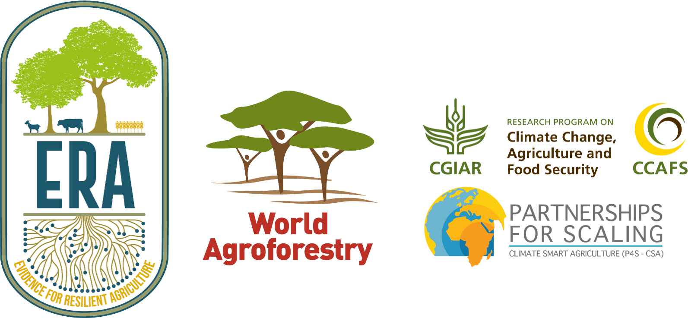

{width=80%}


## Background

This website have been prepared as part of my final outcome of my MSc Internship at the [Evidence for Resilient Agriculture (ERA)](https://era.ccafs.cgiar.org) project at the World Agroforestry Centre, Nairobi, Kenya. 

## Executive Summary

Why agroforestry? Agroforestry is the practice of deliberate growing of woody perennials in association with food crops and pastures. It is frequently framed as an important development concept that is able to augment and enhance agricultural systems by alleviating production deficits and reducing risks in the light of changing climates. A solid understanding of how agroforestry in Africa perform compared to non-agroforestry (here after control) is essential to provide the necessary evidence-base for site-specific agroforestry interventions and support. Ultimately, by understanding the nature of how environmental factors influence agroforestry performance global and local stakeholders can perform better decisions on agroforestry under (changing) climate and soil conditions. This is increasingly needed in order to guide agroforestry policies, research and development.

This analysis is divided in five parts: (1) an introduction to ERA's agroforestry data and machine learning using tidymodels, (2) an assessment of the structure and key data and knowledge gaps of the agroforestry data from ERA, (3) a detailed step-by-step guide to the machine learning regression analysis of ERA's agroforestry data. In this section ten machine learning regression algorithms are tested and trained to predict agroforestry performance (using response ratios). (4) an introduction to the tidymodels Workflowsets package, that allows for seamless integrated training of multiple combinations of models and pre-processing steps. (5) a brief guide to how a discretization of the continuous response ratio target feature, can be used to perform a classification analysis. 

Key findings of this agroforestry assessment include: 

1. There was generally a poor but complex relationship between environmental predictors and agroforestry response ratios. 
2. Out of all the model algorithms tested, it was especially the tree-based models that were superior at explaining the relationships between response ratios and environmental predictors. 
3. Soil texture features (sand, clay and silt content) were particularly important factors for the models when predicting response ratios of agroforestry.
4. Increase in sand content had a negative relationship with response ratios of agroforestry.
5. Precipitation features, especially precipitation of driest quarter, was generally having a negative relationship with response ratios of agroforestry. 
5. The temperature feature mean diurnal temperature had a moderately positive relationship with response ratios of agroforestry. 
6. The poor relationship between agroforestry response ratios and environmental factors is likely attributed to the fact that data is indirectly sourced and does not provide detailed spatial and temporal resolution.

These results can together with appropriate socio-economic studies provide the necessary evidence for where the implemented and/support of agroforestry can result in optimal outcomes. These finding suggests that the benefit of agroforestry expressed as the performance compared to control, is likely higher in areas where soils are sandy, precipitation is low and temperature fluctuations high. Thus, implementing and/or supporting agroforestry in areas that have these specific environmental contexts, can potentially assure relatively higher crop and biomass yields compared to control practices. 

The kind of evidence presented in this analysis can together with socio-economic studies be relevant for stakeholders (governments, NGO’s and development initiatives) have to evaluate where to focus on agroforestry, compared to other agricultural practices. These findings can help in the quest for Option-by-Context a methodology developed by [@Sinclair2019] as it elucidate important biophysical contexts in which agroforestry is likely to perform better. 


### Key Words

**Agroforestry**, **Agriculture**, **Data Science**, **Resilience**, **Machine Learning**, **Informed Decision-Making**

---------------------------------------

### Foreword 

This has truly been an adventure with steep learning curves, joy, frustrations and ups and downs. I learned a lot!

### Acknowledgments

This internship have been a great learning experience - however very different from what I had imagined initially! Due to the global Covid-19 pandemic, affecting people and organisations in Kenya as well as in The Netherlands, I had to drastically re-align my internship objectives, approaches and expectations. I had to adapt to the the "new normal". A reality of working 100 % online and interaction with my supervisors and colleges only though screens. Had it not been for the remarkable support and passionate exchange of ideas and challenges from the ERA team, I don't know how I would have gotten though. On this regard, I especially want to express my gratitude to Namita Joshi, that has always been encouraging and stimmulative to talk to. Without her insight knowledge on ERA and its structures and organisation, I would not have pulled it off in a similar manner. I also wish to give a big acknowledge and thanks to Peter Steward that has been handling the whole supervisor role tremendously. From his quick responses on issues on Slack, to his sincere effort of getting the best out of the situation by listening and taking tame to discuss potential directions of my internship. Lastly I want to thank Todd Rosenstock for accepting me on the ERA team. This has allowed me to experience the great dynamics and passion of The World Agroforestry Centre. A global truly pioneering organisation when it comes to enabling farmers, researchers and development stakeholders with practice techniques and knowledge to facilitate sustainability and resilience in the much needed food and agricultural systems transformation. I want to thank The World Agroforestry Centre for allowing me to conduct this internship, that offered me an exceptional opportunity to gain new valuable skills in data analytics, machine learning and web-based app development. 

### Shoutout to #OpenSouce

I want to express my deepest gratitude and appreciation for all the people out there who contribute to -and advocate for the Open Source movement. Without the extremely educative and detailed materials made freely available by these awesome people, I would not have been able to do this. I am especially thankful for the Youtube tutorial I have learned a lot from by [Andrew Couch](https://github.com/andrew-couch) and [Julia Silge](https://github.com/juliasilge) on everything from data wrangling in tidyverse to machine learning using tidymodels. And thanks to Andrew I could solve major issues on tidymodels due to his great detailed replies on several emails!  

### Distill for R Markdown 

**This website have been developed using Distill for R Markdown**

Distill is an interactive, publication format for scientific and technical writing, native to the web. Learn more about using Distill for R Markdown at <https://rstudio.github.io/distill> and <https://distill.pub>.

**Global website settings:**

```{r Global website setup, echo=TRUE}
knitr::opts_chunk$set(
  echo = TRUE,
  warning = FALSE,
  message = FALSE,
  comment = "#",
  R.options = list(width = 60)
  )
```
